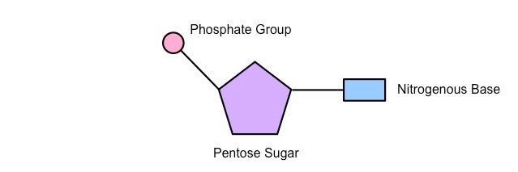
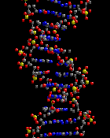
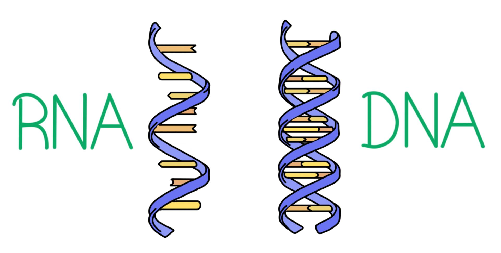
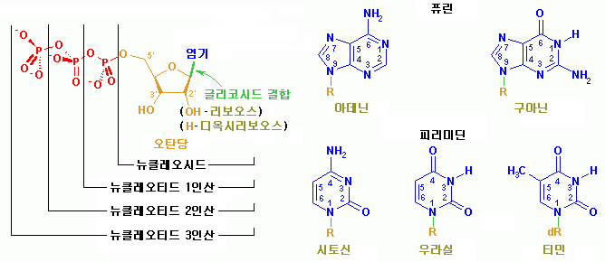
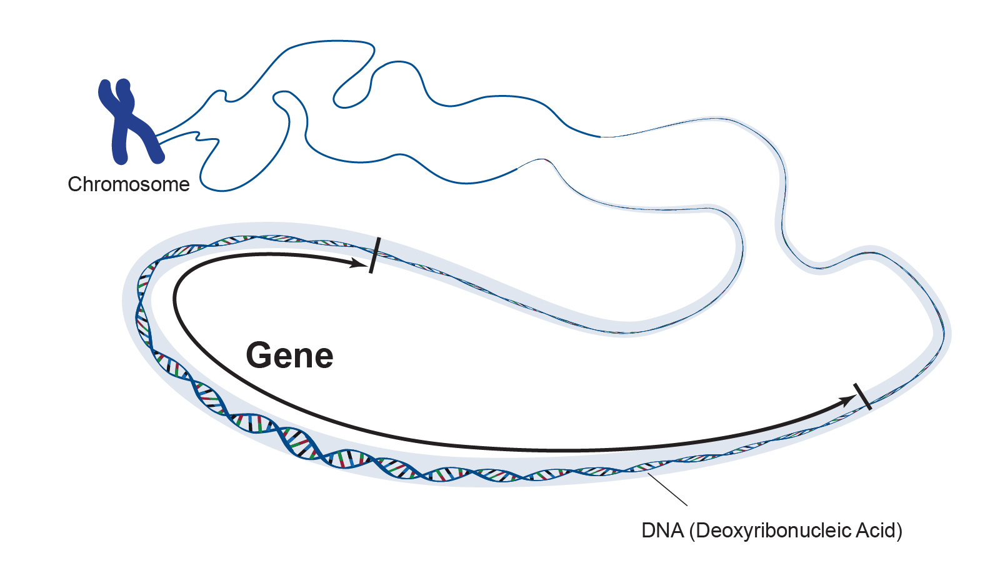
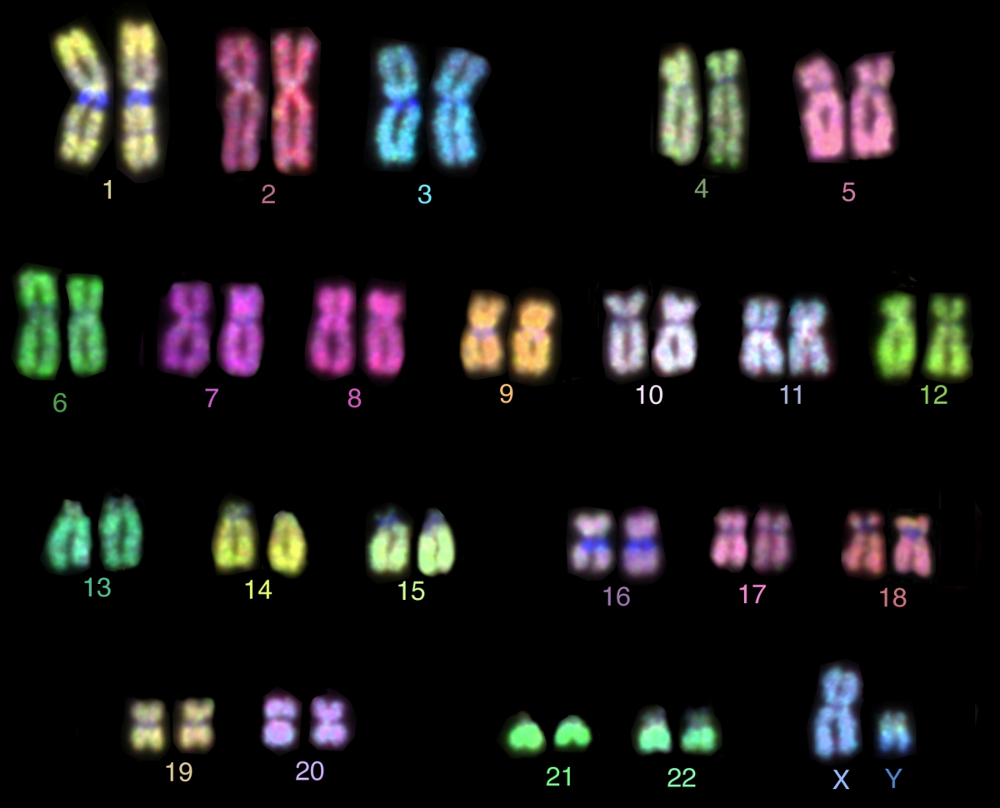
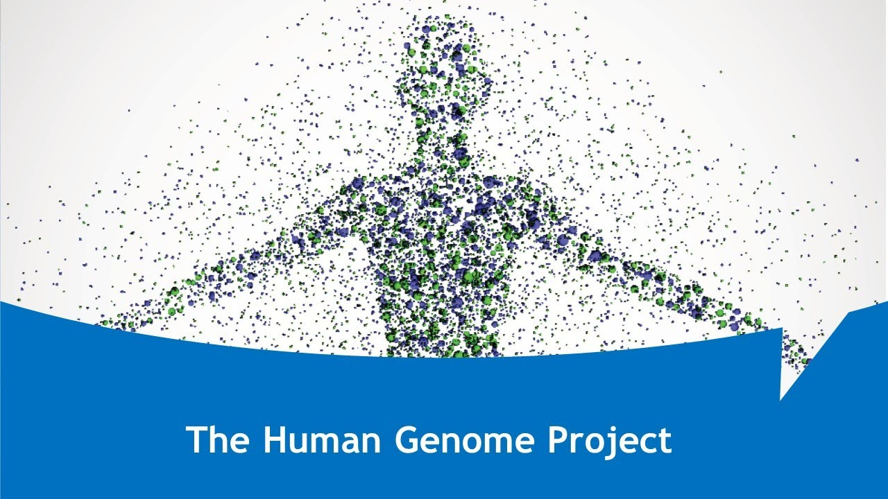

> 최근 NGS(Next-Generation Sequencing)이 널리 활용됨에 따라 바이오 빅데이터가 홍수처럼 넘치고 있다. 이에 따라 현대 생물학은 변화를 맞이하고 있다. 방대한 규모의 바이오 빅데이터 안에서 생물학적으로 의미있는 정보들을 얻어내기 위해 전산학과 통계학접 접근법이 필요하게 되었고, 그 결과 생물정보학이라는 학문이 탄생하였다.[^1]

## Bioinformatics의 정의

Bio(생물)과 informatics(정보과학, 전산학)의 합성어다. Bioinformatics는 전산학, 통계학적인 기술들을 이용하여 대량으로 생산되는 생물학 관련 데이터를 분석하는 분야이다.

## 유전학에 관련된 용어들

우리 몸은 세포로 이루어져 있다. 세포에는 핵이, 핵에는 염색체가, 염색체에는 DNA가 있다.

DNA는 뉴클레오티드(Nucleotide)라는 단위로 구성되어 있으며, DNA 체인인 유전자를 이룬다.

뉴클레오티드는 **당**, **염기**, **인산**으로 이루어져 있는데 이 염기에 우리가 아는 서열이 나오게 된다. C/G/A/T 즉, 시토신, 구아닌, 아데닌, 티민으로 이루어져 있으며 아데닌, 구아닌은 퓨린으로 시토신과 우라실, 티민은 피리미딘으로 나누어진다.

---

### DNA

간단한 설명 : 암호화된 유전정보를 가지고 있는 화합물.

복잡한 설명 : 뉴클레오타이드의 중합체인 두 개의 긴 가닥이 서로 꼬여있는 잉중나선 구조로 되어있는 고분자화합물. DNA는 시토신(사이토신), 구아닌, 아데닌, 티민이라는 4종류의 가득으로 뉴클레오타이드의 중합체를 연결하고 있다. 이는 핵염기로 구분되기 때문에 DNA 염기서열이라고 부른다. DNA 염기서열이 모두 유전정보를 나타내지는 않는다. 유전자 구간은 유전정보를 설명하지만 그렇지 않은 '비부호화 DNA' 구간도 존재한다. 과거에 기능을 가진 유전자였더라도 돌연변이를 통해 기능을 상실한 슈도진[^2]이 되면 비부호화 DNA가 된다.

---

### RNA

간단한 설명 : DNA를 이루는 핵산의 일종.

복잡한 설명 : 5탄당의 일종인 리보스를 기반으로 염기와 인산으로 된 고분자화합물. 분자구조와 생물학적 기능에 따라 크게 다섯가지로 구분된다.

- rRNA : 리보솜을 구성하는 RNA
- mRNA : DNA의 유전정보가 복사된 청사진 역할. 이를 기본으로 하여 리보솜에서 단백질을 구성
- tRNA : 안티코돈을 가지고 있으며, 그에 대응하는 특정 아미노산을 꼬리쪽에 달고 있는 RNA
- miRNA : 생물의 유전자 발현을 제어하는 역할
- siRNA : 특정 단백질의 생산을 방해해 유전자 발현을 억제

### 뉴클레오티드

간단한 설명 : DNA라는 복합체를 구성하는 단위체.

복잡한 설명 : 핵산을 구성하는 단위체인 분자이다. 뉴클레오티드는 대사에 중추적인 역할을 한다. 그 용량으로 인해 화학적 에너지의 공급자(ATP)이며, 세포내 신호계 그리고 효소 반응의 중요성분으로 작용한다.

---

###Gene

간단한 설명 : 유전자의 기본 단위로 하나의 기능을 수행하게 명령하는 DNA 사슬

복잡한 설명 : 게놈 서열의 특정한 위치에 있는 구간으로 유전형질의 단위가 되는 것으로 정의되는데, DNA서열의 일부분을 이루며 조절 구간, 전사 구간, 기타 기능이 부여된 구간 등으로 구성된다.

### Chromosome

간단한 설명 : 많은 DNA를 포함하는 유전물질

복잡한 설명 : 진핵세포를 지닌 생물의 세포분열과정에서만 관찰되며, 세포분열기에 들어가면서 유전물질을 안전하게 보호하고 딸세포들에게 형평성있게 유전정보를 분배하기위해 염색사가 꼬이고 뭉쳐져 응축되어 X자형태를 이룬 구조물이다. 또한 유전 정보를 담아 전달하는 역할을 하는 것이며, 세포를 관찰하기 위해 사용하는 특정 염색액에 잘 염색 된다고 하여 붙여진 이름이다.

---

### Genome Project

간단한 설명 : 특정한 종의 유전체를 알아내는 프로젝트

복잡한 설명 : 1990년에서 2003년까지 인간 게놈에 있는 약 32억개의 뉴클레오티드 염기쌍의 서열을 밝히는 것을 목적으로 한 프로젝트이다. 이 결과로 인해 많은 질병들의 원인이 되는 유전자의 염색체 상에서의 위치를 이해할 수 있게 되었다. 이 프로젝트의 자세한 내용은 [여기]([https://ko.wikipedia.org/wiki/%EC%9D%B8%EA%B0%84_%EA%B2%8C%EB%86%88_%ED%94%84%EB%A1%9C%EC%A0%9D%ED%8A%B8](https://ko.wikipedia.org/wiki/인간_게놈_프로젝트))를 참고.

---

### Reference

http://www.incodom.kr/RNA 
https://ko.wikipedia.org/ 
http://ko.experiments.wikidok.net/wp-d/59d05f520966ec85478c0be5/View https://www.expii.com/t/dna-vs-rna-10205 

[^1]: [생물정보학 연구실](http://biosci.snu.ac.kr/baeklab/aboutus) 의 연구실 소개 인용.
[^2]: 세포의 유전자 발현이나 단백질 합성에 관여하지 않는 DNA 염기서열

